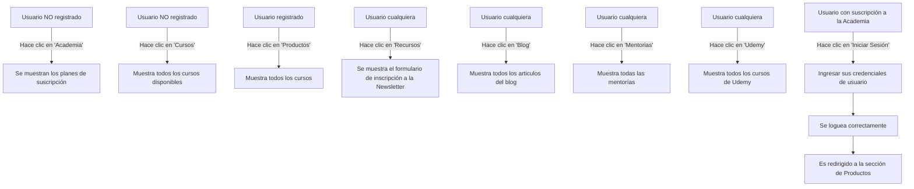

# Desafío de Febrero 2025 Free Range Testers

Con este primer desafío, comenzamos una serie de retos lógicos dentro de la web de [FRT](https://www.freerangetesters.com), con el fin de probar los flujos de usuario en la web.

## Descripción

Ya conocés la web de Free Range Testers. Sabés que hay cursos, que hay suscripciones, que hay descargables gratuitos y que podés o no acceder a cada uno de esos productos dependiendo qué tanto configuraste tu cuenta de usuario.

Tu misión va a ser, utilizando lo que sabés sobre técnicas de Testing Funcional (tip: Mirate el curso de Introducción al Testing de Software), crear casos de prueba para probar los flujos de usuario.

Podés usar mindmaps, tablas, bullet points...lo que quieras. Vas a documentar tus pruebas propuestas en un repositorio de GitHub y crear un Pull Request asignándomelo a mi como reviewer para que pueda corregir, darte feedback y discutir lo que proponés.

## Requisitos

- Tener una cuenta de usuario en [FRT](https://www.freerangetesters.com)
- Saber que hay cursos, que hay suscripciones, que hay descargables gratuitos y que podés o no acceder a cada uno de esos productos dependiendo qué tanto configuraste tu cuenta de usuario.

## Recursos

- [Introducción al Testing de Software](https://www.udemy.com/course/introduccion-al-testing-de-software/)
- [Free Range Testers](https://www.freerangetesters.com)

## Entrega

- [Pruebas de usuario](https://github.com/javice/FRT_Desafios_Logicos/Desafío_Febrero.md)

# Casos de Prueba de Usuario para FreeRangeTesters.com

## Casos de Prueba

### Caso 1: Usuario no registrado
**Descripción:** Verificar que un usuario no registrado no puede acceder a los cursos en el apartado 'Academia'.

**Pasos:**
1. Navegar a https://www.freerangetesters.com.
2. Hacer clic en el enlace 'Academia' en el menú principal.
3. Verificar que se muestran los planes de suscripción en [Academia](https://www.freerangetesters.com/academia).

**Resultado Esperado:**
- El usuario ve la oferta de suscripción.

### Caso 2: Usuario no registrado puede ver los listados de cursos
**Descripción:** Verificar que un usuario no registrado puede ver los listados de cursos en el apartado ['Cursos'](https://www.freerangetesters.com/cursos).

**Pasos:**
1. Navegar a https://www.freerangetesters.com.
2. Navegar al apartado 'Cursos'.
3. Verificar que se muestran todos los cursos.

**Resultado Esperado:**
- El usuario ve la totalidad de los cursos ofertados.

### Caso 3: Usuario con suscripción a la Academia
**Descripción:** Verificar que un usuario con suscripción a la Academia tiene acceso completo a los cursos en el apartado 'Productos'.

**Pasos:**
1. Iniciar sesión con una cuenta con una suscripción a la Academia.
2. Navegar al apartado 'Productos'.
3. Verificar que se muestran todos los cursos disponibles.

**Resultado Esperado:**
- El usuario puede ver y acceder a todos los cursos.

### Caso 4: Cualquier usuario (registrdo o no) puede ver Recursos Gratuitos
**Descripción:** Verificar que un usuario cualquiera puede ver la sección Recursos.

**Pasos:**
1. Navegar a https://www.freerangetesters.com.
2. Navegar al apartado 'Recursos'.
3. Verificar que se muestra el formulario de inscripción a la Newsletter al final de la página.

**Resultado Esperado:**
- El usuario accede a la sección de Recursos correctamente.

### Caso 5: Cualquier usuario (registrdo o no) puede acceder al Blog
**Descripción:** Verificar que cualquier usuario puede acceder al apartado 'Blog'.

**Pasos:**
1. Navegar a https://www.freerangetesters.com.
2. Navegar al apartado 'Blog'.
3. Verificar que se muestran los articulos del blog.

**Resultado Esperado:**
- El usuario puede ver y acceder al blog.

### Caso 6: Cualquier usuario (registrdo o no) puede acceder a la sección de Mentorías
**Descripción:** Verificar que cualquier usuario puede acceder a la sección de Mentorías.

**Pasos:**
1. Navegar a https://www.freerangetesters.com.
2. Navegar al apartado 'Mentorias'.
3. Verificar que se muestra la sección de mentorías.

**Resultado Esperado:**
- El usuario puede ver y acceder a las mentorías.

### Caso 7: Cualquier usuario (registrdo o no) puede acceder al apartado de Udemy
**Descripción:** Verificar que cualquier usuario puede acceder al apartado de Udemy.

**Pasos:**
1. Navegar a https://www.freerangetesters.com.
2. Navegar al apartado 'Udemy'.
3. Verificar que se muestran todos los cursos de Udemy.

**Resultado Esperado:**
- El usuario puede ver y acceder a los cursos de Udemy.

### Caso 8: Usuario registrado se loguea correctamente
**Descripción:** Verificar que un usuario registrado se loguea correctamente.

**Pasos:**
1. Navegar a https://www.freerangetesters.com.
2. Navegar al apartado 'Iniciar Sesión'.
3. Ingresar sus credenciales de usuario.
4. Verificar que el usuario se loguea correctamente y es redirigido a la sección de Productos.

**Resultado Esperado:**
- El usuario se loguea correctamente y es redirigido a la sección de Productos.

## Diagramas 

### Diagrama de Flujo de Acceso a FRT completo

